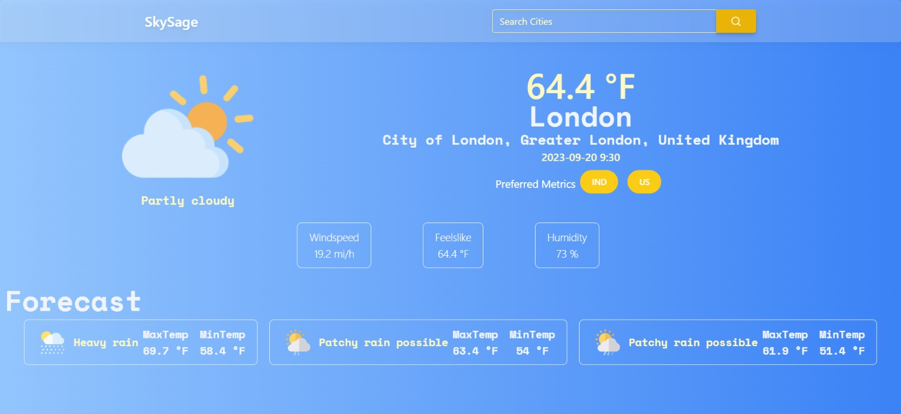

# SkySage Weather App

SkySage is a versatile weather app built with Vite, React, and the WeatherAPI, designed to provide you with up-to-date weather information for any location. With SkySage, you can easily check the current weather conditions and receive forecasts for the upcoming three days. It also includes a convenient search functionality to find weather data for your desired locations. Moreover, SkySage supports toggling between the US and Indian metric systems for temperature and other measurements.



## Features

- **Current Weather**: Get real-time weather information for your chosen location.
- **3-Day Forecast**: Access weather forecasts for the next three days.
- **Search Functionality**: Search for weather data by location name.
- **US and Indian Metric Systems**: Toggle between US and Indian metric systems for temperature and other measurements.
- **User-Friendly Interface**: SkySage offers a clean and user-friendly interface for an effortless weather checking experience.
- **Loading Spinner**: Visual feedback with React Spinners while fetching data.
- **Toast Notifications**: Informative toast notifications powered by React Hot Toast for a better user experience.

## Demo

You can check out a live demo of SkySage Weather App [here](https://skysage.vercel.app/).

## Installation

Follow these steps to set up and run the SkySage Weather App on your local machine:

1. **Clone the repository**:

   ```bash
   git clone https://github.com/KamalJoshi-web/SkySage.git
   ```

2. **Navigate to the project directory**:

   ```bash
   cd SkySage
   ```

3. **Install dependencies** using your package manager of choice (e.g., npm or yarn):

   ```bash
   npm install
   # or
   yarn install
   ```

4. **Create a `.env` file** in the project root and add your WeatherAPI API key:

   ```
   VITE_WEATHER_API_KEY=your_api_key_here
   ```

   Replace `your_api_key_here` with your actual WeatherAPI API key. You can obtain an API key by signing up on the [WeatherAPI website](https://www.weatherapi.com/).

5. **Start the development server**:

   ```bash
   npm run dev
   # or
   yarn dev
   ```

6. The app should now be running locally. Open your web browser and access it at [http://localhost:3000](http://localhost:3000).

## Dependencies

SkySage Weather App relies on the following dependencies:

- [axios](https://axios-http.com/): A promise-based HTTP client for making requests to the WeatherAPI.
- [react-spinners](https://www.npmjs.com/package/react-spinners): A library for adding loading spinners to your React application.
- [react-hot-toast](https://www.npmjs.com/package/react-hot-toast): A simple and customizable toast notification library for React.

## Contributing

Contributions to SkySage Weather App are welcome! If you find a bug or have an enhancement in mind, please open an issue or submit a pull request.

## License

This project is licensed under the MIT License - see the [LICENSE](LICENSE) file for details.

---

Developed with ❤️ by Kamal Joshi.
